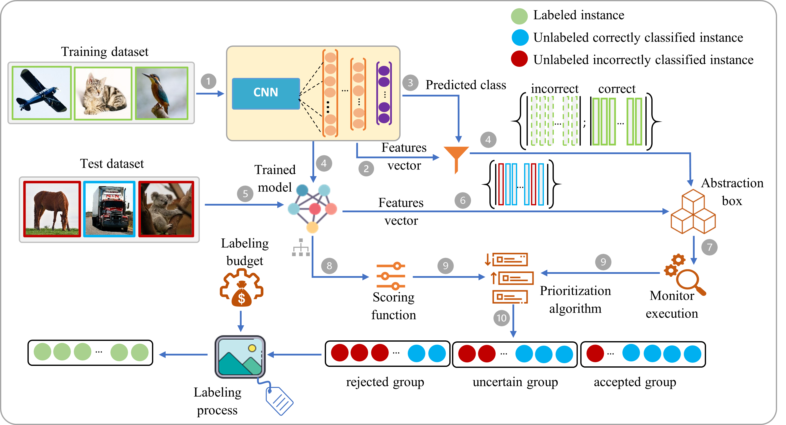
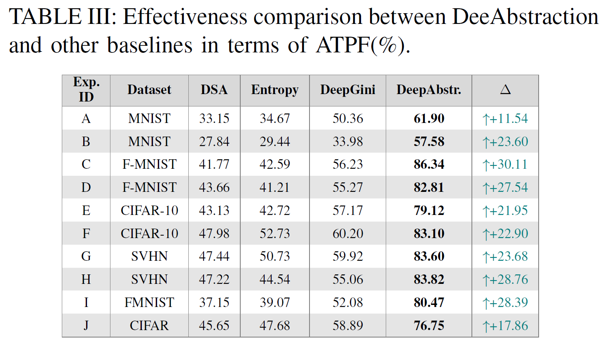
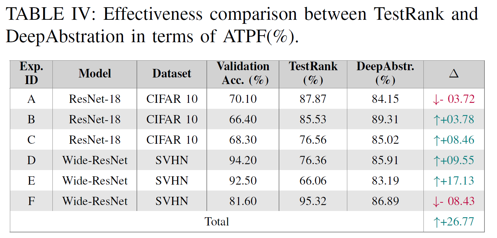

# DeepAbstraction

DeepAbstraction is an open-source framework mainly used to prioritize misclassified instances among the entire unlabeled test dataset in deep learning systems. 

-------

The framework has been moved to <a href="https://gricad-gitlab.univ-grenoble-alpes.fr/alqadash/towards-robust-neural-network/-/tree/master/Paper%201/src">here</a>. Please feel free to contact me if you have any further inqueries: hamzah.al-qadasi@univ-grenoble-alpes.fr` :email: :mailbox_with_no_mail:

-------
## Framework Workflow[.](https://icons8.com/icons)

-------
## Experimental Setup

-------
## Experimental Results

-------

